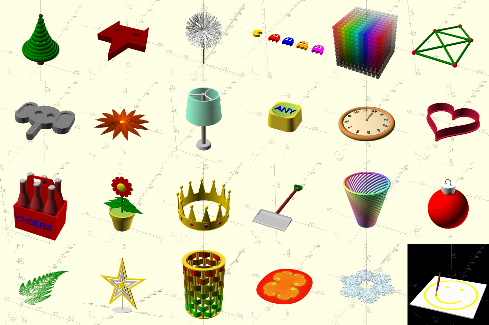

# openscad-advent-calendar-2020



- [x] `Tu 1. tree`
- [x] `We 2. fox-head`
- [x] `Th 3. dandelion`
- [x] `Fr 4. pacman`
- [x] `Sa 5. color-cube`
- [x] `So 6. nikolaus`
- [x] `Mo 7. elephant`
- [x] `Tu 8. flower`
- [x] `We 9. lamp`
- [x] `Th 10. any-key`
- [x] `Fr 11. clock`
- [x] `Sa 12. cookie-cutter`
- [x] `So 13. sixpack`
- [x] `Mo 14. flower-in-pot`
- [x] `Tu 15. crown`
- [x] `We 16. snowshovel`
- [x] `Th 17. vase`
- [x] `Fr 18. bauble`
- [x] `Sa 19. barnsley-fern`
- [x] `So 20. star`
- [x] `Mo 21. wavy-thing`
- [x] `Tu 22. julia`
- [ ] `We 23. `
- [ ] `Th 24. `
```

* Must work with OpenSCAD 2019.05 (e.g. not snapshot version)
* Should be relatively small and self contained
* Designs need to be CC0
* Web design and the snow library is covered by MIT License
* Idea is to put them later up as HowTo
